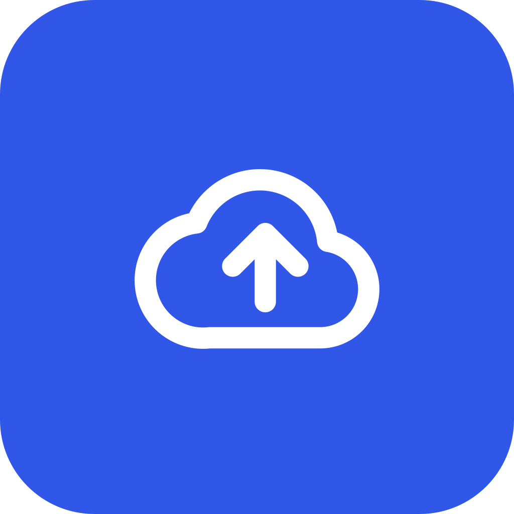
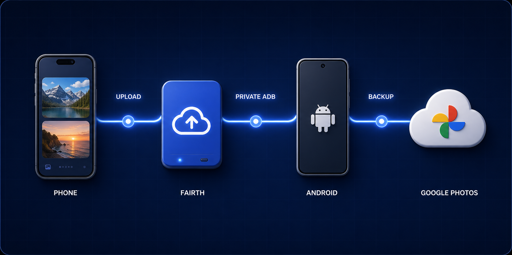

<div align="center">
  <br />
  
  <h1>Fairth</h1>
  <p>A self-hosted bridge from your phone to Google Photos.</p>
  <p>
    <a href="#quick-start">Quick start</a>
    ·
    <a href="docs/networking.md">Networking</a>
    ·
    <a href="artifacts/README.md">Android artifacts</a>
  </p>
</div>

Fairth queues photos and videos on an Android companion, transfers them in resumable chunks, and imports them into a private Android appliance. The official Google Photos app handles the final cloud backup, so Fairth never receives or stores your Google password.

<p align="center">
  
</p>

The phone talks only to the non-privileged Fairth application. Its worker crosses a private Docker network over ADB to Redroid, the only privileged container. ADB and the Android viewer are never exposed publicly.

## Highlights

- Durable, resumable uploads for large photos and videos
- Automatic and share-sheet uploads from the Android companion
- MediaStore import verification, SHA-256 deduplication, and retry handling
- Revocable device enrollment without sharing owner credentials
- Persistent Android state for Google sign-in and Photos configuration
- Automated provisioning for user-supplied Magisk, LSPosed, and PixelMask artifacts

## Requirements

- A Linux host with rootful Docker, Android Binder support, and PSI enabled
- 4 to 8 GB of RAM plus storage for Android and incoming media
- A locally built Redroid image with GApps, Google Photos, Magisk, and ARM translation
- A trusted LAN, tailnet, or SSH tunnel for the private Android viewer

Fairth does not commit or redistribute proprietary Google or root packages. The included builder assembles the Android image locally from pinned inputs.

## Quick start

```bash
git clone https://github.com/AugusDogus/fairth.git
cd fairth
bun install
cp .env.example .env
bin/fairth-android build-image
bin/fairth-android up
```

Open the owner setup URL printed by Fairth, create the owner account, and complete the guided Android setup at `/onboarding`.

```bash
bin/fairth-android status
bin/fairth-android logs
bin/fairth-android down
```

See [Networking and TLS](docs/networking.md) before exposing Fairth beyond a trusted network. The Android viewer provides full control of the virtual device and must never be placed behind a public reverse proxy.

## Companion app

The companion requires a development or release Android build because its uploader includes a local Kotlin module. It does not run in Expo Go.

```bash
cd apps/companion
cp .env.example .env
npx expo run:android
```

Set `EXPO_PUBLIC_FAIRTH_PRIMARY_ENDPOINT` in `apps/companion/.env`, then enroll the phone by scanning the one-time QR code from Fairth's onboarding page. The app can back up selected albums automatically or queue individual images from Android's share sheet.

## Development

```bash
bun install
bun run check
```

The repository is organized as a Bun workspace:

- `apps/web`: owner UI, authentication, upload API, and storage
- `apps/android-worker`: ADB import and Android automation
- `apps/android-viewer`: private scrcpy and noVNC viewer
- `apps/companion`: Expo app and native background uploader
- `packages/android-rpc`: shared Android worker client

For Android artifact placement and provisioning, see [artifacts/README.md](artifacts/README.md).
